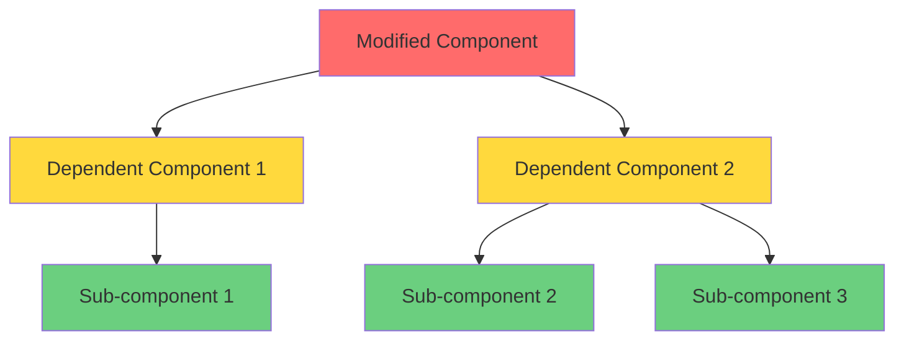

# Impact Analysis Report

**Date:** [YYYY-MM-DD]  
**Analyst:** IBM Bob (Architect Mode)  
**Project:** [Project Name]

---

## 1. Change Request Summary

### Description
[Detailed description of the requested change]

### Scope
- **Files to Modify:** [List of files]
- **New Files:** [List of new files to create]
- **Estimated Complexity:** [LOW/MEDIUM/HIGH]

### Objectives
- [Objective 1]
- [Objective 2]
- [Objective 3]

---

## 2. Architecture Decision Records (ADR) Alignment

### Consulted ADRs
- **ADR-XXX:** [Title] - [Path to ADR file]
- **ADR-YYY:** [Title] - [Path to ADR file]

### Alignment Status
- ✅ **ALIGNED** - Change follows existing architectural decisions
- ⚠️ **REQUIRES NEW ADR** - New architectural decision needed
- ❌ **CONFLICTS** - Change conflicts with existing ADR

### Details
[Explanation of alignment status, conflicts, or need for new ADR]

### Recommendations
- [Recommendation 1]
- [Recommendation 2]

---

## 3. Affected Components

### Component A: [Component Name]
- **Impact Level:** 🔴 HIGH / 🟡 MEDIUM / 🟢 LOW
- **Files Affected:**
  - `path/to/file1.ext` - [Description of changes]
  - `path/to/file2.ext` - [Description of changes]
- **Functions/Methods:**
  - `functionName()` - [Impact description]
- **Reason:** [Why this component is affected]

### Component B: [Component Name]
- **Impact Level:** 🔴 HIGH / 🟡 MEDIUM / 🟢 LOW
- **Files Affected:**
  - `path/to/file3.ext` - [Description of changes]
- **Functions/Methods:**
  - `methodName()` - [Impact description]
- **Reason:** [Why this component is affected]

### Component C: [Component Name]
- **Impact Level:** 🔴 HIGH / 🟡 MEDIUM / 🟢 LOW
- **Files Affected:**
  - `path/to/file4.ext` - [Description of changes]
- **Reason:** [Why this component is affected]

---

## 4. Dependencies Map



**Legend:**
- 🔴 Red: Direct modification
- 🟡 Yellow: High impact dependency
- 🟢 Green: Low impact dependency

### Dependency Details
- **Direct Dependencies:** [List components that directly depend on modified code]
- **Indirect Dependencies:** [List components indirectly affected]
- **External Dependencies:** [List external libraries or services affected]

---

## 5. Cyclomatic Complexity Analysis

### Current Complexity Metrics

| Function/Method | Current CC | Classification | File |
|----------------|------------|----------------|------|
| `functionA()` | 5 | 🟢 Low | `path/to/file.ext` |
| `functionB()` | 12 | 🟡 Medium | `path/to/file.ext` |
| `functionC()` | 18 | 🔴 High | `path/to/file.ext` |

### Projected Complexity After Change

| Function/Method | Current CC | Projected CC | Change | Status | Recommendation |
|----------------|------------|--------------|--------|--------|----------------|
| `functionA()` | 5 | 7 | +2 | ✅ Acceptable | No action needed |
| `functionB()` | 12 | 15 | +3 | ⚠️ Warning | Consider refactoring |
| `functionC()` | 18 | 22 | +4 | ❌ Critical | **Must refactor** |

### Complexity Analysis Summary

**Overall Impact:** [POSITIVE/NEUTRAL/NEGATIVE]

**Key Findings:**
- [Finding 1: e.g., "3 functions will exceed CC threshold of 15"]
- [Finding 2: e.g., "New helper functions reduce overall complexity"]
- [Finding 3: e.g., "Refactoring opportunity identified in Module X"]

### Refactoring Recommendations

1. **Function: `functionC()`**
   - **Current CC:** 18
   - **Projected CC:** 22
   - **Recommendation:** Extract method pattern
   - **Suggested Actions:**
     - Extract conditional logic into `validateInput()` helper
     - Move error handling to `handleError()` helper
     - Reduce nested loops by using functional programming
   - **Expected CC After Refactoring:** 8-10

2. **Function: `functionB()`**
   - **Current CC:** 12
   - **Projected CC:** 15
   - **Recommendation:** Simplify conditional logic
   - **Suggested Actions:**
     - Replace nested if-else with strategy pattern
     - Use early returns to reduce nesting
   - **Expected CC After Refactoring:** 9-11

---

## 6. Risk Assessment

### Breaking Changes
- ❌ **[Breaking Change 1]**
  - **Impact:** [Description]
  - **Affected:** [List of affected components]
  - **Mitigation:** [How to handle]

- ❌ **[Breaking Change 2]**
  - **Impact:** [Description]
  - **Affected:** [List of affected components]
  - **Mitigation:** [How to handle]

### Regression Risks

| Risk | Probability | Impact | Severity | Mitigation |
|------|-------------|--------|----------|------------|
| [Risk 1] | HIGH/MEDIUM/LOW | HIGH/MEDIUM/LOW | 🔴/🟡/🟢 | [Mitigation strategy] |
| [Risk 2] | HIGH/MEDIUM/LOW | HIGH/MEDIUM/LOW | 🔴/🟡/🟢 | [Mitigation strategy] |
| [Risk 3] | HIGH/MEDIUM/LOW | HIGH/MEDIUM/LOW | 🔴/🟡/🟢 | [Mitigation strategy] |

### Test Coverage Gaps

**Current Coverage:** [X%]  
**Target Coverage:** [Y%]

**Identified Gaps:**
- ⚠️ **Gap 1:** [Description of uncovered code path]
  - **Location:** `path/to/file.ext:line-range`
  - **Required Tests:** [List of tests needed]

- ⚠️ **Gap 2:** [Description of uncovered edge case]
  - **Location:** `path/to/file.ext:line-range`
  - **Required Tests:** [List of tests needed]

### Security Considerations
- [Security consideration 1]
- [Security consideration 2]

### Performance Implications
- [Performance impact 1]
- [Performance impact 2]

---

## 7. Test Execution Results

### Pre-Change Test Status

```bash
$ [test command, e.g., npm test]

Test Suites: X passed, X total
Tests:       Y passed, Y total
Snapshots:   Z total
Time:        Xs
Coverage:    XX% statements, XX% branches, XX% functions, XX% lines
```

### Test Results Summary
- ✅ **All existing tests passing:** [Yes/No]
- ✅ **No regressions detected:** [Yes/No]
- ⚠️ **Tests requiring updates:** [Number]
- 🆕 **New tests needed:** [Number]

### Failing Tests (if any)
- ❌ **Test Name:** `test/path/file.test.ext`
  - **Reason:** [Why it fails]
  - **Action Required:** [What needs to be done]

---

## 8. Recommended Actions

### Priority 1: Critical (Must Do Before Implementation)
1. ✅ **[Action 1]**
   - **Reason:** [Why this is critical]
   - **Estimated Time:** [Time estimate]

2. ✅ **[Action 2]**
   - **Reason:** [Why this is critical]
   - **Estimated Time:** [Time estimate]

### Priority 2: Important (Should Do)
1. ⚠️ **[Action 3]**
   - **Reason:** [Why this is important]
   - **Estimated Time:** [Time estimate]

2. ⚠️ **[Action 4]**
   - **Reason:** [Why this is important]
   - **Estimated Time:** [Time estimate]

### Priority 3: Optional (Nice to Have)
1. 💡 **[Action 5]**
   - **Reason:** [Why this would be beneficial]
   - **Estimated Time:** [Time estimate]

---

## 9. Implementation Plan

### Phase 1: Preparation
- [ ] Review and approve this impact analysis
- [ ] Create/update ADR if needed
- [ ] Set up feature branch
- [ ] Notify team of upcoming changes

### Phase 2: Test Suite Development
- [ ] Write new unit tests
- [ ] Update existing tests
- [ ] Create regression tests
- [ ] Validate test coverage

### Phase 3: Implementation
- [ ] Implement changes in order of dependency
- [ ] Run tests after each significant change
- [ ] Refactor high-complexity functions
- [ ] Update documentation

### Phase 4: Validation
- [ ] Run full test suite
- [ ] Perform manual testing
- [ ] Code review
- [ ] Performance testing (if applicable)

### Phase 5: Deployment
- [ ] Merge to main branch
- [ ] Deploy to staging
- [ ] Monitor for issues
- [ ] Deploy to production

---

## 10. Rollback Strategy

### Rollback Triggers
- [Condition 1 that would require rollback]
- [Condition 2 that would require rollback]

### Rollback Steps
1. [Step 1]
2. [Step 2]
3. [Step 3]

### Rollback Time Estimate
**Estimated Time:** [X minutes/hours]

---

## 11. Sign-off

### Analysis Completed By
- **Name:** IBM Bob (Architect Mode)
- **Date:** [YYYY-MM-DD]
- **Confidence Level:** [HIGH/MEDIUM/LOW]

### Approval Required From
- [ ] **Tech Lead:** [Name]
- [ ] **Architect:** [Name]
- [ ] **QA Lead:** [Name]

### Notes
[Any additional notes or considerations]

---

## 12. Appendix

### References
- [Link to related documentation]
- [Link to similar changes]
- [Link to relevant ADRs]

### Tools Used
- IBM Bob Architect Mode
- [Other analysis tools]

### Metrics Collected
- Lines of Code Changed: [Number]
- Files Modified: [Number]
- Test Cases Added: [Number]
- Complexity Reduction: [Number or N/A]